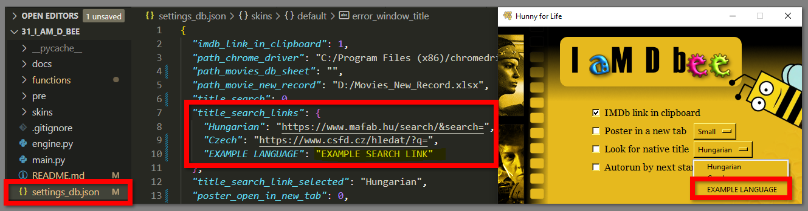
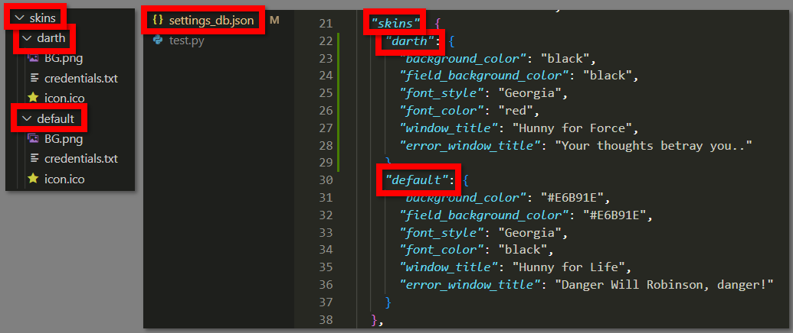

# Work in progress
## Movie Details Collector
- `MODEC` collects and copies of your selected motion picture's basic details to your movie DB Excel sheet
- Using [The Movie Database API](https://www.themoviedb.org/documentation/api) and `IMDb id/link`
- Inspired by my previous project: [I aM D bee](https://github.com/K4KarolE/I_aM_D_bee)

 


- Automatically opens the sheet
- If selected: 
    - Movie posters will be listed in a new browser tab
    - Searches for the movie on the selected, non-English movie site

<div align="center">
     
</div>

<br>
<div align="center">
     
</div>

<!-- 
# Requirements
## Python and Modules
### Install packages\dependencies
```
pip install -r requirements.txt
```
### Separately
### Python 3 - used: 3.11
- https://www.python.org/

### Pyperclip
- https://pypi.org/project/pyperclip/

### Openpyxl
- https://pypi.org/project/openpyxl/

## Others
### Google Chrome
- https://www.google.co.uk/chrome/

### Excel
- Any excel app installed on your system (`MS Excel`, `LibreOffice Calc`)

### Target Excel Sheet
- Recommended: `docs\ Movies_DB.xlsx`

### OS
- `Windows` (tested on 10)
- `Linux` (tested on Mint 21):
    - Window icon will not be displayed
    - Excel sheets will not open automatically
    - The checkbox text placement can be off, solution:
        - Change the font style to `Arial` in `settings_db.json \ skins \ [every skin] \ font_style`  
    - `Pyperclip` module: "On Linux, this module makes use of the xclip or xsel commands, which should come with the os. Otherwise run “sudo apt-get install xclip” or “sudo apt-get install xsel” (Note: xsel does not always seem to work.) Otherwise on Linux, you will need the gtk or PyQt4 modules installed. "

# Guide
## Directors
- For `TV Series`, `TV Mini Series` the `Director` value will not be populated in the Excel sheet
- Most of the time even 1 season is directed by multiple directors

## Posters in new tab
- Opens the movie posters in a new browser tab
- Poster size width estimates: 
    - Small ~ 200px
    - Medium ~ 500px
    - Large ~ 1000px <
<!-- <div align="center">
     
</div> -->
<!-- 
## Look for native title
- Searches for the movie on the selected, non-English movie site:
    - Uses the title and the release year of the movie
    - Adds it to the end of the selected search link
    - Opens it in a new browser tab

## Quit after run
- Automatically exit after the engine function is executed (data collection and writing, poster in new tab, ..)

## Target sheet path - Mandatory
- Recommended: `docs\Movies_DB.xlsx`
- You are able to add the new location of the sheet (if you relocated it)
- If you are using your own sheet:
    - It should NOT contain pictures (`openpyxl` module removes the pictures from the sheet)
    - No merged cells for the `Directors`, `Stars` values (more than one cell can be used in the same column)

# Tips and Tricks
## How to add a new "Look for native title" option
- Just add your key-value pair in `settings_db.json \ title_search_links` and it will be automatically listed at the next start
- Make sure your link is suitable for concatenation

<div align="center">
     
</div>

## How to add a new skin
- In the `skins` folder create a new folder with the name of your skin
- Place your version of `BG.png` and `icon.ico` into the folder (`BG.png`: 500x600)
- In the `settings_db.json \ skins` create a new dictionary with the same name of your folder
- In the `settings_db.json \ skins \ your skin` amend the parameters as you wish
- The new skin will be automatically listed at the next start

<div align="center">
     
</div>

## How to test your updated skin without clicking 'Save&Start' again
Scenario: you updated the `BG.png` background picture in an already existing skin
- Change the skin with the `Skins` button for different one and back to the updated one
- Every skin change triggers the `save & update function` (for the skin only)
- Your updated picture should be visible without restarting the program

# Modules used, which are part of Python 3.11
- datetime
- json
- os
- pathlib
- platform
- random
- shutil
- sys
- tkinter
- webbrowser

## Thank you all who worked on the modules listed in this document! -->
