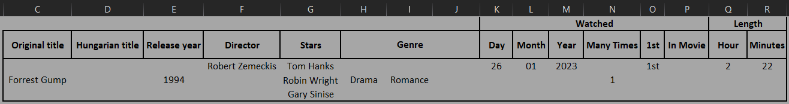
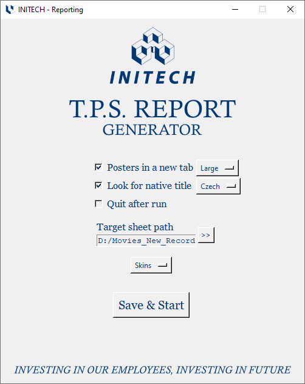
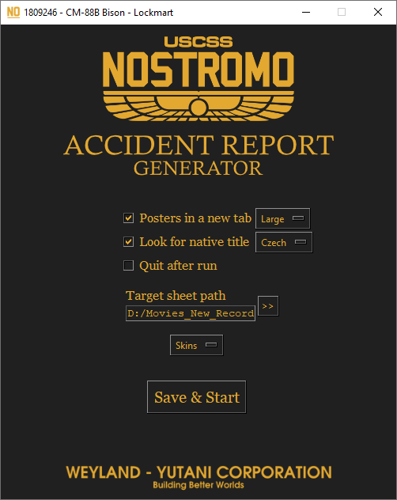
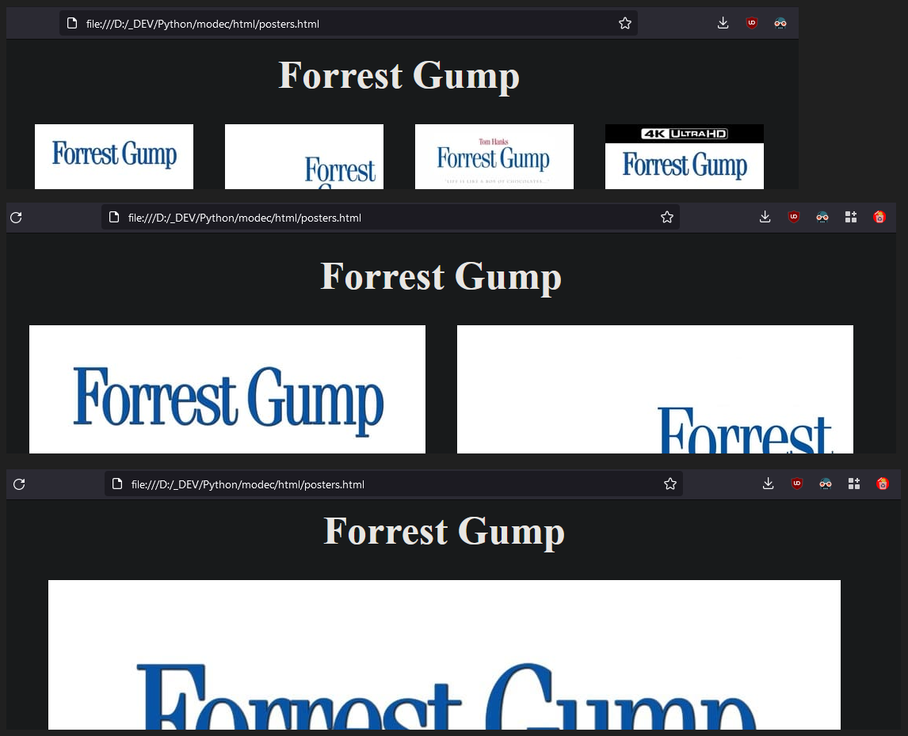

# Movie Details Collector
- `MODEC` collects and copies of your selected motion picture's basic details to your target Excel sheet

 

- Automatically opens the sheet
- If selected: 
    - According to the selected poster size: html page will be generated and opened in a new browser tab
    - Searches for the movie on the selected, non-English movie site
- Using [The Movie Database API](https://www.themoviedb.org/documentation/api) and `IMDb link or movie ID`
- Inspired by my previous project: [I aM D bee](https://github.com/K4KarolE/I_aM_D_bee)

<div align="center">
     
</div>

<br>
<div align="center">
     
</div>


# Requirements
## Python and Modules
### Install packages\dependencies
```
pip install -r requirements.txt
```
### Separately
### Python 3 - used: 3.11
- https://www.python.org/

### Pyperclip
- https://pypi.org/project/pyperclip/

### Requests
- https://pypi.org/project/requests/

### Openpyxl
- https://pypi.org/project/openpyxl/

## Others
### The Movie Database API key
- Register and request an API key at [The Movie Database API](https://www.themoviedb.org/documentation/api)
- It is 100% FREE
- Save the `API key` in the `api_key.txt` file

### Excel
- Any excel app installed on your system (`MS Excel`, `LibreOffice Calc`)

### Target Excel Sheet
- Recommended: `docs\ Movies_New_Record.xlsx`

### OS
- `Windows` (tested on 10, 11)
- `Linux` (tested on Mint 22):
    - Window icon will not be displayed
    - Excel sheets will not open automatically

# Guide
## Steps
- Copy your selected motion picture's `IMDb link or ID` to your clipboard
- Add the target excel sheet in `MODEC`
- Set the non-mandatory paramaters as you wish (3 checkboxes, roll-down menus)
- Click `Save&Start`

## Directors
- For `TV Series`, `TV Mini Series` the `Director` value will not be populated in the Excel sheet
- Most of the time even 1 season is directed by multiple directors

## Posters in new tab
- The generated `posters.html` will be opened in a new browser tab
- Poster`s width size estimates: 
    - Small ~ 200px - 4/row
    - Medium ~ 500px - 2/row
    - Large ~ original = 1000px < - 1/row
<div align="center">
     
</div> 

## Look for native title
- Searches for the movie on the selected, non-English movie site:
    - Uses the `title` and the `release year` of the movie
    - Adds it to the end of the selected search link
    - Opens it in a new browser tab

## Quit after run
- Automatically exit after the engine function is executed (data collection and writing, poster in new tab, ..)

## Target sheet path - Mandatory
- Recommended: `docs\Movies_New_Record.xlsx`
- You are able to add the location of the sheet
- If you are using your own sheet:
    - No merged cells for the `Directors`, `Stars` values (more than one cell can be used in the same column)


# Modules used, which are part of Python 3.11
- datetime
- json
- os
- pathlib
- platform
- sys
- tkinter
- webbrowser

## Thank you all who worked on the modules listed in this document!
## Thank you The Movie Database team!
